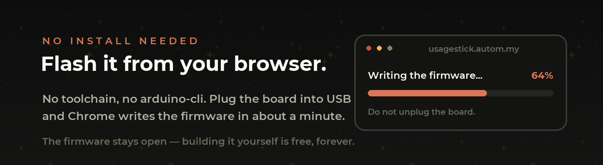

<div align="center">


# Clow Deck

**Every AI coding session you have open — on one touch screen, in your hand.**<br>
Claude Code, Codex and opencode. Tap to jump in. Hold to drive.

**English** · [Português](README.pt-BR.md)


<br>


</div>

---

You end up with six terminals open and no idea which one is waiting for you. One is compiling,
one wants permission to write a file, one finished four minutes ago, and the one you actually
care about is buried behind a browser window.

**Clow Deck puts all of them on a small screen on your desk.** Each session gets a tile that
glows green while it works, flashes amber when it needs you, and settles when it's done. Tap a
tile and the right window jumps to the front. Hold it and you get the controls — approve, escape,
enter, `/compact`, push-to-talk — without touching the keyboard.

The screen itself is a **dumb peripheral**: it draws what it receives and reports touches. All
the thinking happens in a small agent on your computer, and **no credential ever reaches the
device**.

---

## Contents

- [What it shows you](#what-it-shows-you)
- [Three engines, one deck](#three-engines-one-deck)
- [The screens](#the-screens)
- [Getting one running](#getting-one-running)
  - [Don't want to install a toolchain?](#dont-want-to-install-a-toolchain)
- [Hardware](#hardware)
- [What it can't do yet](#what-it-cant-do-yet)
- [License](#license)

---

## What it shows you

Sessions are discovered automatically — you don't register anything. The agent watches for
`claude`, `codex` and `opencode` processes, figures out which terminal or editor window each one
lives in, and gives it a tile.

State comes from the engine itself, not from guessing:

| Tile | Means | Where it comes from |
|:--:|---|---|
| 🟢 **green, pulsing** | working right now | a tool call started, a prompt was submitted |
| 🟠 **amber, flashing** | **waiting for you** | a permission request or a notification |
| 🫒 **olive** | finished, unread | the turn ended |
| ⬜ **dim** | idle | started, nothing happening |
| 🔴 **red** | error | the session failed |

The amber flash is the one that matters. It's the difference between noticing a permission
prompt in three seconds and finding it ten minutes later.

Each tile also carries the **project name**, how long it's been in that state, and a chip naming
the engine (`CC` · `CDX` · `OC`) over that engine's own logo, faded into the background.

---

## Three engines, one deck

Clow Deck speaks to all three, and it does **not** pretend they're identical — the same button
does the right thing per engine, or politely refuses when the engine has no equivalent.

| | **Claude Code** | **Codex** | **opencode** |
|---|:--:|:--:|:--:|
| Live session states | hooks | `app-server` | sqlite event log |
| Focus window · Esc · Enter · Tab | ✅ | ✅ | ✅ |
| Approve a pending request | `1` | `y` | Enter |
| Cycle mode | `Shift+Tab` | ❌ *use `/approvals`* | `Tab` (build ↔ plan) |
| New session | `/clear` | `/new` | `/new` |
| `/init` · `/compact` | ✅ | ✅ | `/init` |
| Quit | `/exit` | `/quit` | `/exit` |
| Push-to-talk | ✅ *Claude Code's `/voice`* | ❌ | ❌ |

> Claude-Code-only commands (`/voice`, `/config`, `/permissions`…) are **blocked** on the other
> two rather than sent blindly. On the bench, a stray `/voice` fuzzy-matched to `/review` in
> opencode and ran it — so now the deck refuses instead.

**How each one is tracked.** Claude Code reports through its own hooks, so state is exact and
instant. Codex runs an embedded `app-server` the agent polls for thread status. opencode
event-sources into sqlite, which the agent tails read-only — a pending tool approval shows up as
a tool part with `status = "pending"`, which is what drives the amber flash.

---

## The screens

> The images are **pixel-accurate mockups**, rendered from the firmware's own geometry, palette,
> icons and fonts — regenerate them with `python3 tools/gen_mockups.py`. Real photos coming soon.

Every screen is the same **3×4 grid**: nine cells and a free strip at the bottom. That's not a
style choice — the 3D-printed divider sits in the 4 px gaps, so the layout can never shift.

### Home — all your sessions


Six session tiles on the top two rows. The third row is always yours: **language**, **brightness**
and **settings**. The strip at the bottom is the brand and the BLE link indicator.

- **Tap** a tile → that session's window comes to the front, and the tile becomes the *active*
  one (coral border). Tapping a finished session also marks it read.
- **Hold** a tile → the actions page for that session.
- Sessions keep their tile until they die, so muscle memory works: the third tile stays the third
  tile all day.

<br clear="right">

### Session — the controls


Nine buttons for the session you picked:

- **focus** — raise the window again
- **voice** — *hold* to talk (Claude Code's `/voice`), release to transcribe
- **mode** — cycle permission mode
- **esc** · **enter** · **tab** — the keys you actually reach for; `tab` accepts the suggestion
  the terminal is offering
- **/compact** — compact the context
- **more** → the commands page

When a session is **waiting for permission**, this page changes: *voice* and *mode* become
**approve** and **deny**, and they blink so you can act without reading anything.

<br clear="right">

### Commands — the rest


What page one doesn't have: **new session**, **`/init`**, **`/exit`**, plus **your own commands**
from the config file. Destructive ones ask for confirmation on the device.

Add your own by dropping a `[[commands]]` block in `config.toml` — label, text, and whether it
should confirm. They're pushed to the deck over BLE, paginated with `>`.

<br clear="right">

### Searching for a host


Before the agent connects — or if you unplug it — the deck shows the mascot, the BLE status and
its own MAC. Holding the mascot opens **Settings**, so brightness and language work even with no
computer attached.

<br clear="right">

---

## Getting one running

Three pieces: a **board**, the **firmware** on it, and the **agent** on your computer.

### 1. Install the app

Download from **[Releases](https://github.com/benevid/projeto-claude-deck/releases/latest)**:

| Platform | File |
|---|---|
| **macOS** (Apple Silicon) | `ClowDeck-<version>-macos-arm64.dmg` — signed and notarized, opens with no Gatekeeper warning |
| **Windows** (x64) | `ClowDeck-<version>-windows-x64-setup.exe` — or the `.msi` for deployment |

Launch it and you get an invader in the menu bar / system tray. Open **the virtual deck** from
that menu — your sessions appear on their own, and **you can use the whole thing right there
before you own any hardware**. Then click **Install hooks** so Claude Code reports its state.

macOS will ask for **Accessibility** (to send keystrokes) and **Bluetooth**. Windows installers
aren't code-signed yet, so SmartScreen warns on first run — *More info → Run anyway*.

### 2. Flash the board

Everything you need is in this repository: the firmware source, the exact board, the pin map and
the build commands. Flashing it yourself with `arduino-cli` is documented in
**[BUILD.md](BUILD.md)** and **costs nothing**.

```bash
./flash.sh                    # autodetects the port, compiles and flashes
```

### Don't want to install a toolchain?

<a href="https://usagestick.autom.my"></a>

If you're short on time — or simply don't want to deal with `arduino-cli`, board packages and
libraries — there's a hosted flasher at **[usagestick.autom.my](https://usagestick.autom.my)**.
Create an account, plug the board into USB, and Chrome writes the firmware straight to it over
Web Serial. It takes about a minute and installs nothing on your machine.

That service charges a **small one-off fee per board**, which pays for hosting and for building
the convenience. To be explicit about what is being sold:

- **You are not paying for the firmware.** It is open, it is right here, and you can build and
  flash it for free, forever, without an account.
- The fee covers **the convenience** of doing it from a browser. It is entirely optional.
- One payment covers **one board, for good** — including future firmware versions on that board.

If you're comfortable with a terminal, skip it and use [BUILD.md](BUILD.md).

### 3. Pair

Power the board, open the app. On macOS the pairing dialog appears on the first write and the
deck shows a 6-digit passkey — type it once and both sides remember.

On **Windows**, pair from a desktop session with `clowdeck-agent.exe ble pair`, and check your
Bluetooth adapter first: it must support the **BLE central role with LE Secure Connections**.
A TP-Link UB500 works; a Realtek RTL8821CU does not. Details in
**[docs/WINDOWS.md](docs/WINDOWS.md)**.

---

## Hardware

**Guition JC4832W535** — ESP32-S3 with an AXS15231B 480×320 QSPI touch panel, used in portrait
at 320×480. Roughly the size of a deck of cards. Pin map, tested library versions and the flush
pipeline are in [`firmware/REFERENCIA-HARDWARE-LVGL.md`](firmware/REFERENCIA-HARDWARE-LVGL.md).

The connection is **Bluetooth LE** with bonding, MITM protection and LE Secure Connections. The
device holds no tokens, no Wi-Fi credentials and no session content — just labels, states and
the touches it sends back. Firmware updates are over USB only, by design.

A printable **3×4 divider grid** that turns the flat glass into something you can find by feel is
in [`case-3d/`](case-3d/).

---

## What it can't do yet

- **It can't pick a terminal tab.** The agent raises the right window — Terminal.app and iTerm2
  by exact TTY, VS Code/Cursor/Windsurf by the window holding that folder — but which tab is
  focused inside it is yours to manage.
- **Voice is Claude Code's.** You turn `/voice` on once per session, and the dictation language
  follows Claude Code's setting, not the deck's.
- **The usage strip isn't wired.** The protocol and the rendering exist; the agent doesn't send
  it yet.
- **Windows Bluetooth is picky** — see above.
- **Intel Macs** aren't covered by the release binary; build from source.

---

## License

**[PolyForm Noncommercial 1.0.0](LICENSE.md)** — use it, change it, build it, put it on your own
desk, share it. Use it at a nonprofit, a school or a public institution. What you may **not** do
is sell it, or sell a product or service built on it, to anyone else.

If you want to do something commercial with it, ask.

---

<div align="center">

Built by **Benevid Felix Silva** · [benevid@gmail.com](mailto:benevid@gmail.com)

Technical documentation: **[BUILD.md](BUILD.md)** · [`protocol/PROTOCOL.md`](protocol/PROTOCOL.md) · [`design/THEME.md`](design/THEME.md) · [`docs/WINDOWS.md`](docs/WINDOWS.md)

</div>
