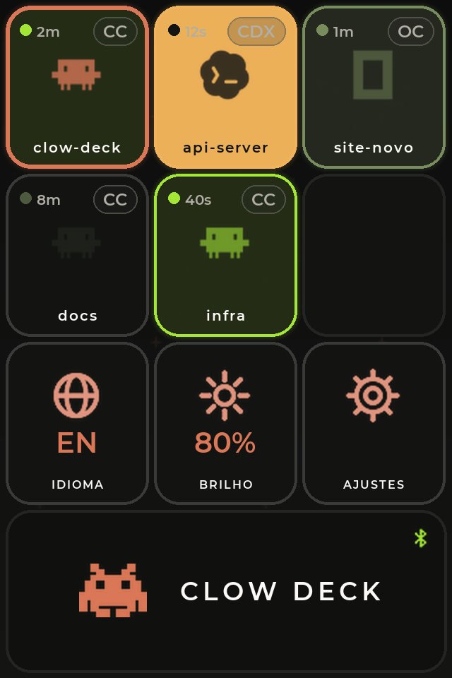
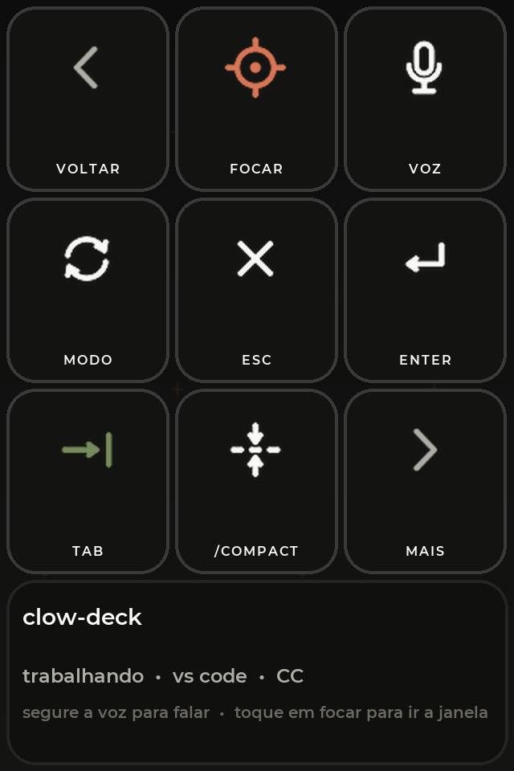
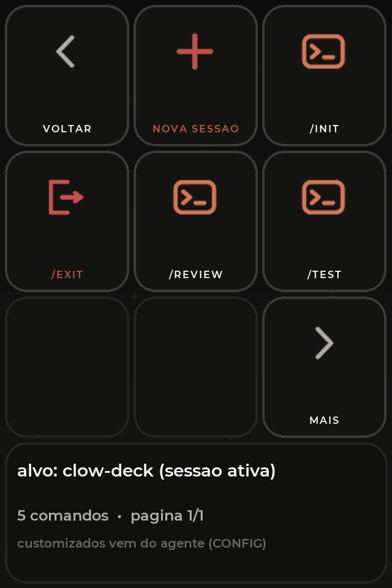
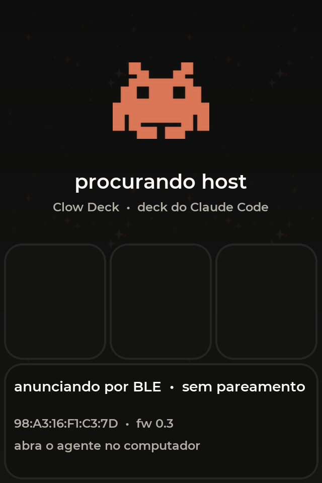

# Clow Deck

**Todas as sessões de IA que você deixou abertas — numa tela de toque, na sua mão.** 
Claude Code, Codex e opencode. Toque para entrar. Segure para controlar.

[English](README.md) · **Português**

 

---

Você acaba com seis terminais abertos e nenhuma ideia de qual está esperando por você. Um está
compilando, outro quer permissão para escrever um arquivo, um terminou quatro minutos atrás, e
justamente o que interessa está enterrado atrás de uma janela do navegador.

**O Clow Deck coloca todos eles numa telinha na sua mesa.** Cada sessão ganha um bloco que brilha
verde enquanto trabalha, pisca âmbar quando precisa de você, e se acalma quando termina. Toque no
bloco e a janela certa vem para a frente. Segure e você tem os controles — aprovar, esc, enter,
`/compact`, falar — sem tocar no teclado.

A tela em si é um **periférico burro**: desenha o que recebe e reporta toques. Todo o raciocínio
acontece num agente pequeno no seu computador, e **nenhuma credencial chega ao dispositivo**.

---

## Índice

- [O que ele te mostra](#o-que-ele-te-mostra)
- [Três engines, um deck](#três-engines-um-deck)
- [As telas](#as-telas)
- [Colocando um para funcionar](#colocando-um-para-funcionar)
- [Hardware](#hardware)
- [O que ainda não dá](#o-que-ainda-não-dá)
- [Licença](#licença)

---

## O que ele te mostra

As sessões são descobertas sozinhas — você não cadastra nada. O agente procura processos
`claude`, `codex` e `opencode`, descobre em qual terminal ou janela de editor cada um vive, e dá
um bloco para ele.

O estado vem da própria engine, não de adivinhação:

| Bloco | Significa | De onde vem |
|:--:|---|---|
| 🟢 **verde, pulsando** | trabalhando agora | uma ferramenta começou, um prompt foi enviado |
| 🟠 **âmbar, piscando** | **esperando você** | pedido de permissão ou notificação |
| 🫒 **oliva** | terminou, não lido | o turno acabou |
| ⬜ **apagado** | ocioso | iniciou, nada acontecendo |
| 🔴 **vermelho** | erro | a sessão falhou |

O piscar âmbar é o que importa. É a diferença entre notar um pedido de permissão em três segundos
e achá-lo dez minutos depois.

Cada bloco também traz o **nome do projeto**, há quanto tempo está naquele estado, e um chip com a
engine (`CC` · `CDX` · `OC`) sobre o logo dela, esmaecido ao fundo.

---

## Três engines, um deck

O Clow Deck fala com as três, e **não** finge que são iguais — o mesmo botão faz a coisa certa em
cada uma, ou recusa educadamente quando a engine não tem equivalente.

| | **Claude Code** | **Codex** | **opencode** |
|---|:--:|:--:|:--:|
| Estados ao vivo | hooks | `app-server` | log de eventos sqlite |
| Focar janela · Esc · Enter · Tab | ✅ | ✅ | ✅ |
| Aprovar pedido pendente | `1` | `y` | Enter |
| Alternar modo | `Shift+Tab` | ❌ *use `/approvals`* | `Tab` (build ↔ plan) |
| Nova sessão | `/clear` | `/new` | `/new` |
| `/init` · `/compact` | ✅ | ✅ | `/init` |
| Sair | `/exit` | `/quit` | `/exit` |
| Falar (push-to-talk) | ✅ *o `/voice` do Claude Code* | ❌ | ❌ |

> Comandos que só existem no Claude Code (`/voice`, `/config`, `/permissions`…) são **bloqueados**
> nas outras duas, em vez de enviados às cegas. Na bancada, um `/voice` solto casou por
> aproximação com `/review` no opencode e executou — por isso o deck agora recusa.

**Como cada uma é acompanhada.** O Claude Code reporta pelos próprios hooks, então o estado é
exato e imediato. O Codex roda um `app-server` embutido que o agente consulta. O opencode faz
event-sourcing em sqlite, que o agente lê em modo somente-leitura — uma aprovação pendente
aparece como uma parte de ferramenta com `status = "pending"`, e é isso que dispara o âmbar.

---

## As telas

> As imagens são **mockups pixel-accurate**, renderizados a partir da própria geometria, paleta,
> ícones e fontes do firmware — regenere com `python3 tools/gen_mockups.py`. Fotos reais em breve.

Toda tela é a mesma **grade 3×4**: nove células e uma faixa livre embaixo. Isso não é escolha
estética — a grade divisória impressa em 3D encaixa nos vãos de 4 px, então o layout nunca muda.

### Início — todas as suas sessões

Seis blocos de sessão nas duas primeiras linhas. A terceira linha é sempre sua: **idioma**,
**brilho** e **ajustes**. A faixa de baixo é a marca e o indicador do link BLE.

- **Toque** num bloco → a janela daquela sessão vem para a frente, e o bloco vira o *ativo*
  (borda coral). Tocar numa sessão terminada também marca como lida.
- **Segure** um bloco → a página de ações daquela sessão.
- Sessões mantêm o bloco até morrerem, então a memória muscular funciona: o terceiro bloco
  continua sendo o terceiro o dia inteiro.

 

### Sessão — os controles

Nove botões para a sessão que você escolheu:

- **focar** — trazer a janela de novo
- **voz** — *segure* para falar (o `/voice` do Claude Code), solte para transcrever
- **modo** — alternar o modo de permissão
- **esc** · **enter** · **tab** — as teclas que você realmente usa; `tab` aceita a sugestão que o
  terminal está oferecendo
- **/compact** — compactar o contexto
- **mais** → a página de comandos

Quando uma sessão está **esperando permissão**, esta página muda: *voz* e *modo* viram
**aprovar** e **negar**, e piscam para você agir sem precisar ler nada.

 

### Comandos — o resto

O que a página um não tem: **nova sessão**, **`/init`**, **`/exit`**, e mais os **seus próprios
comandos**, vindos do arquivo de configuração. Os destrutivos pedem confirmação no aparelho.

Adicione os seus com um bloco `[[commands]]` no `config.toml` — rótulo, texto, e se deve
confirmar. Eles vão para o deck por BLE, paginados com `>`.

 

### Procurando um host

Antes de o agente conectar — ou se você desligá-lo — o deck mostra o mascote, o status do BLE e o
próprio MAC. Segurar o mascote abre os **Ajustes**, então brilho e idioma funcionam mesmo sem
computador nenhum conectado.

 

---

## Colocando um para funcionar

Três peças: uma **placa**, o **firmware** nela, e o **agente** no seu computador.

### 1. Instale o app

Baixe em **[Releases](https://github.com/benevid/projeto-claude-deck/releases/latest)**:

| Plataforma | Arquivo |
|---|---|
| **macOS** (Apple Silicon) | `ClowDeck-<versão>-macos-arm64.dmg` — assinado e notarizado, abre sem aviso do Gatekeeper |
| **Windows** (x64) | `ClowDeck-<versão>-windows-x64-setup.exe` — ou o `.msi` para implantação |

Abra e você ganha um invader na barra de menu / bandeja. Abra **o deck virtual** por esse menu —
suas sessões aparecem sozinhas, e **dá para usar tudo ali antes de ter qualquer hardware**.
Depois clique em **Instalar hooks** para o Claude Code reportar o estado dele.

O macOS vai pedir **Acessibilidade** (para enviar teclas) e **Bluetooth**. Os instaladores
Windows ainda não são assinados, então o SmartScreen avisa na primeira execução —
*Mais informações → Executar assim mesmo*.

### 2. Grave a placa

O firmware está aqui, é aberto, e compilá-lo você mesmo com `arduino-cli` não custa nada —
veja **[BUILD.md](BUILD.md)**.

Se você preferir não instalar uma toolchain, um **gravador web está chegando**: pluga a placa na
USB e o Chrome escreve o firmware por Web Serial, em cerca de um minuto, sem instalar nada. Ele
terá uma pequena taxa única por placa, que paga a hospedagem — o mesmo arranjo do
[usagestick.autom.my](https://usagestick.autom.my), o gravador do meu outro projeto. Para ser
explícito sobre o que estaria sendo vendido:

- **Você não está pagando pelo firmware.** Ele está aqui, e você pode compilar e gravar de graça,
  para sempre, sem conta nenhuma.
- A taxa cobre **a conveniência** de fazer isso pelo navegador. É totalmente opcional.
- Um pagamento cobre **uma placa, para sempre** — incluindo versões futuras do firmware nela.

### 3. Pareie

Ligue a placa, abra o app. No macOS o diálogo de pareamento aparece na primeira escrita e o deck
mostra um código de 6 dígitos — digite uma vez e os dois lados lembram.

No **Windows**, pareie de uma sessão de desktop com `clowdeck-agent.exe ble pair`, e confira
antes o seu adaptador Bluetooth: ele precisa suportar o **papel de central BLE com LE Secure
Connections**. Um TP-Link UB500 funciona; um Realtek RTL8821CU não. Detalhes em
**[docs/WINDOWS.md](docs/WINDOWS.md)**.

---

## Hardware

**Guition JC4832W535** — ESP32-S3 com um painel de toque AXS15231B 480×320 QSPI, usado em retrato
a 320×480. Mais ou menos do tamanho de um baralho. Pinagem, versões testadas das bibliotecas e o
pipeline de flush estão em
[`firmware/REFERENCIA-HARDWARE-LVGL.md`](firmware/REFERENCIA-HARDWARE-LVGL.md).

A conexão é **Bluetooth LE** com bonding, proteção MITM e LE Secure Connections. O aparelho não
guarda token, nem credencial de Wi-Fi, nem conteúdo de sessão — só rótulos, estados e os toques
que devolve. Atualização de firmware é só por USB, por decisão de projeto.

Uma **grade divisória 3×4** para impressão, que transforma o vidro liso em algo que se acha pelo
tato, está em [`case-3d/`](case-3d/).

---

## O que ainda não dá

- **Não dá para escolher a aba do terminal.** O agente levanta a janela certa — Terminal.app e
  iTerm2 pelo TTY exato, VS Code/Cursor/Windsurf pela janela que contém aquela pasta — mas qual
  aba fica focada lá dentro é com você.
- **A voz é a do Claude Code.** Você liga o `/voice` uma vez por sessão, e o idioma de ditado
  segue a configuração do Claude Code, não a do deck.
- **A faixa de uso não está ligada.** O protocolo e a renderização existem; o agente ainda não
  envia.
- **O Bluetooth no Windows é exigente** — veja acima.
- **Macs Intel** não são cobertos pelo binário da release; compile do código.

---

## Licença

**[PolyForm Noncommercial 1.0.0](LICENSE.md)** — use, modifique, compile, coloque na sua própria
mesa, compartilhe. Use numa ONG, numa escola ou numa instituição pública. O que você **não** pode
é vender, nem vender um produto ou serviço construído em cima disso, para terceiros.

Se quiser fazer algo comercial com ele, é só perguntar.

---

Feito por **Benevid Felix Silva** · [benevid@gmail.com](mailto:benevid@gmail.com)

Documentação técnica: **[BUILD.md](BUILD.md)** · [`protocol/PROTOCOL.md`](protocol/PROTOCOL.md) · [`design/THEME.md`](design/THEME.md) · [`docs/WINDOWS.md`](docs/WINDOWS.md)

